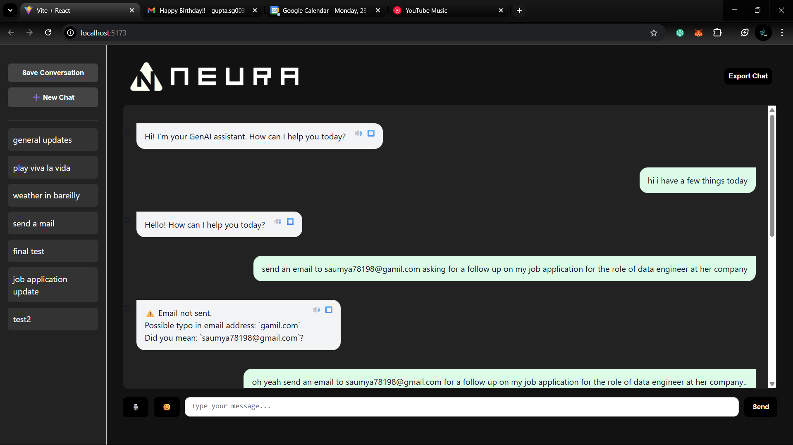
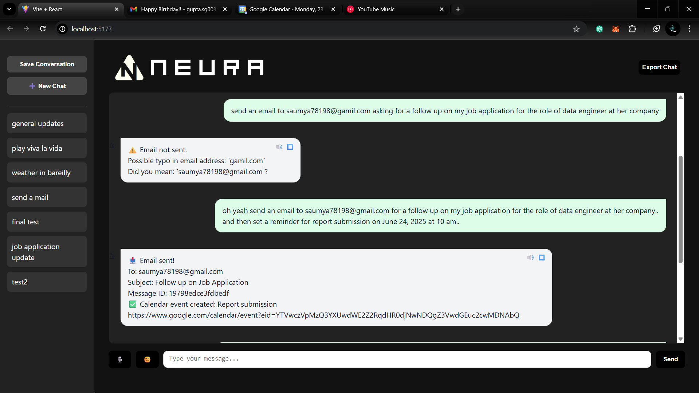
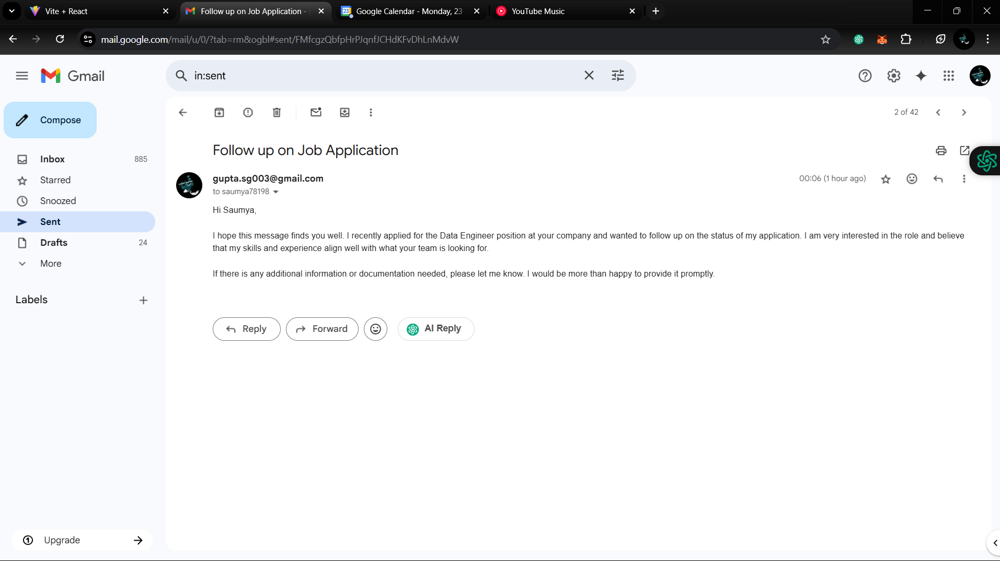
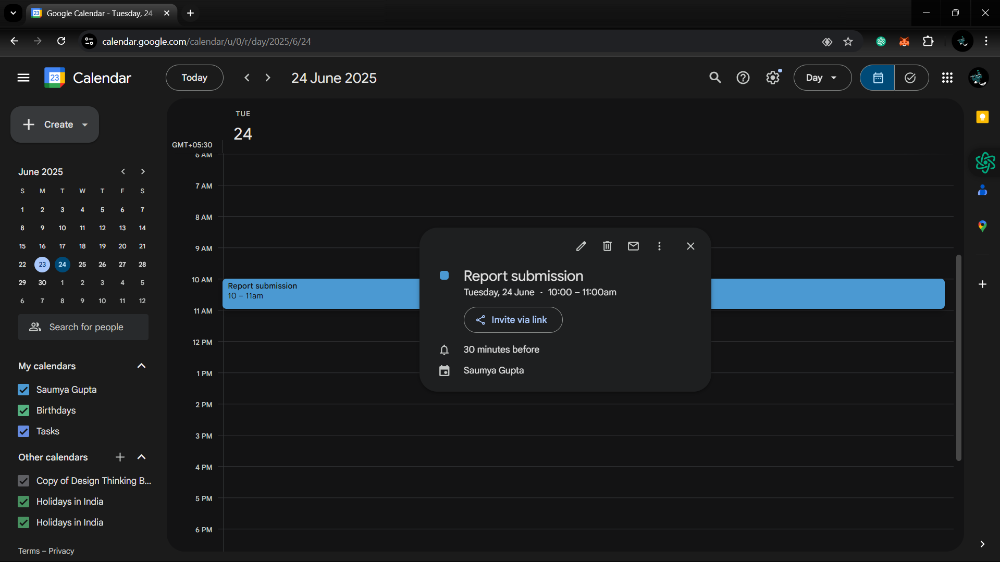
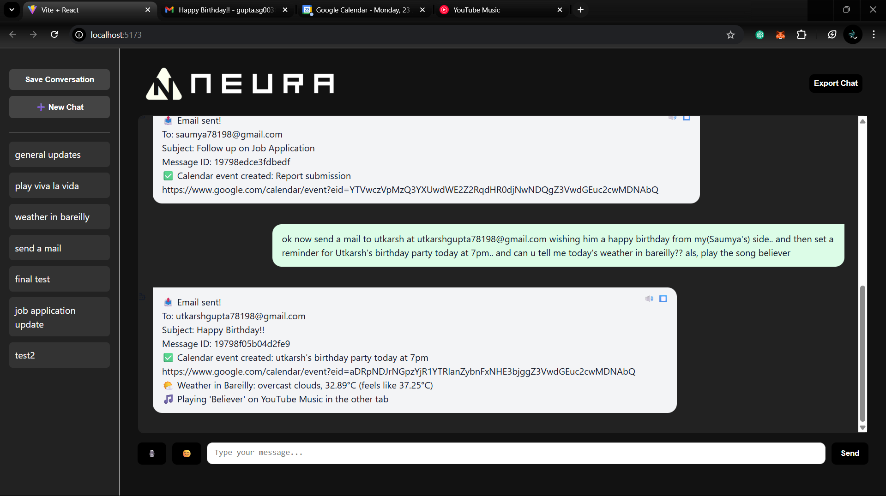
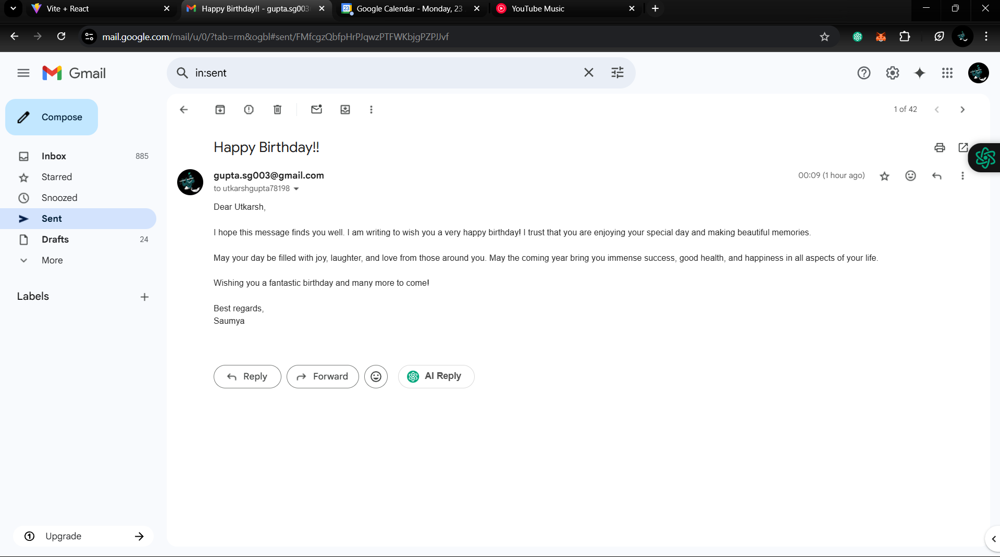
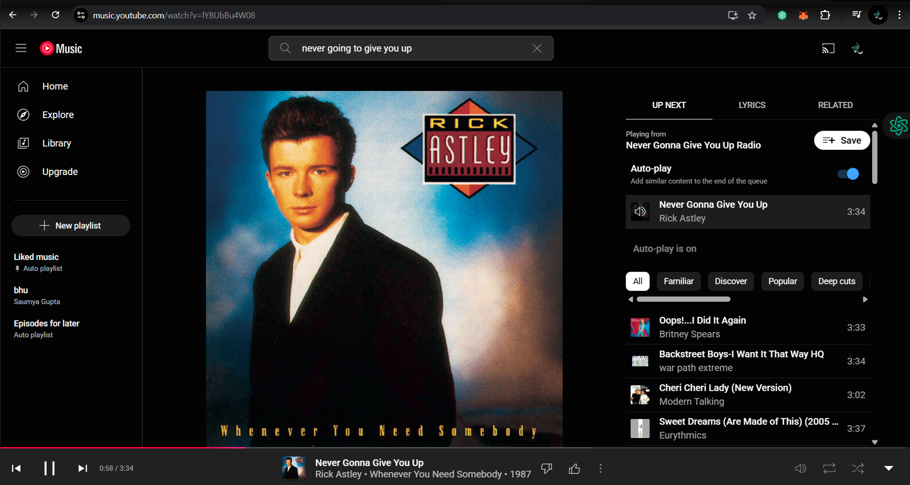

# 🧠 NEURA 
**Chat to Action - Multi task Execution System**   
> *Neura is more than just a chat - it’s a real command executor...*

---

 
## 📌 Overview  
Neura is a locally running, multi-intent natural language command execution system. Instead of writing individual commands, u can simply chat in plain English - and Neura intelligently understands, splits, classifies, and executes each tasks..

It can:

- 📧 Send emails   
- 🎵 Play music  
- 📅 Schedule events  
- 🌦️ Fetch weather  
- 📰 Deliver news  
—all in one go.

---

## 🎯 Key Highlights

- ✅ Multi-intent message handling  
- ⚙️ Modular handler-based design  
- ⚙️ Finetuning of pretrained model T5 for query splitting, and use of other pretrained model and APIs for rest of the tasks
- 💡 LLM-based email generation (local Mistral via ollama)  
- 🌐 React frontend + FastAPI backend  

---

## 🧱 Project Structure

```bash
GENAI_ASSISTANT/
│
├── app/                        
│   ├── config/                 
│   │   ├── credentials.json
│   │   ├── model_config.json
│   │   ├── secrets.json
│   │   └── token.pickle
│   ├── data/                   
│   │   └── queries.jsonl
│   ├── finetuned_query_splitter/  # T5 model files
│   │   ├── config.json
│   │   ├── generation_config.json
│   │   ├── model.safetensors
│   │   ├── special_tokens_map.json
│   │   ├── spiece.model
│   │   ├── tokenizer_config.json
│   │   └── tokenizer.json
│   ├── handlers/               
│   │   ├── calendar.py
│   │   ├── client_secret.json
│   │   ├── email_handler.py
│   │   ├── general.py
│   │   ├── local_llm_generator.py
│   │   ├── music.py
│   │   ├── news.py
│   │   └── weather.py
│   ├── memory_store/
│   ├── offload/
│   ├── api.py
│   ├── intent_classifier.py
│   ├── langchain_agent.py
│   ├── main.py
│   ├── query_splitter.py
│   ├── utils.py
│   └── token.pickle
│
├── genai-ui/                  
│   ├── src/
│   │   ├── assets/
│   │   ├── components/
│   │   │   ├── ChatBubble.jsx
│   │   │   ├── MicInput.jsx
│   │   │   ├── Sidebar.css
│   │   │   ├── Sidebar.jsx
│   │   ├── components/  
│   │   ├── utils/
│   │   ├── App.jsx
│   │   ├── AppRouter.jsx
│   │   ├── Sidebar.jsx
│   │   ├── App.css
│   │   ├── index.css
│   │   └── main.jsx
│   ├── index.html
│   ├── vite.config.js
│   ├── package.json
│   └── package-lock.json
│
├── venv/                       
├── db.sqlite3                 
├── .env                        
├── requirements.txt           
├── README.md                   
├── .gitignore
└── token.pickle
```

---

## ⚙️ Core Workflow

### Step 1: Message Input  
User types or speaks a message:
```text
"Email my boss at name@gmail.com about the meeting, set a reminder for meeting tomorrow, and play the song Viva la Vida."
```

### Step 2: Query Splitting  
The message is split using a fine-tuned T5-small model (1000 samples), with fallback logic to preserve tokens (like emails, names).

### 🔍 Fine-tuned Query Splitter Model

This project includes a custom fine-tuned **T5-small** model for intelligently splitting complex, multi-intent user queries into structured sub-commands. This enables the assistant to process and route multiple tasks from a single user input, such as:

---

#### 🔧 Fine-tuning Details

- **Base model:** [`t5-small`](https://huggingface.co/t5-small)
- **Training platform:** Google Colab
- **Library stack:** `transformers`, `datasets`, `sentencepiece`, `torch`
- **Training dataset:** `queries.jsonl`  
- **Dataset Size:** `1064 samples`
- A JSONL file containing paired examples of `input` (user command) and `output` (query split).
- **Epochs:** 3
- **Loss values:**
  - Epoch 1: `0.1466`
  - Epoch 2: `0.0144`
  - Epoch 3: `0.0102`

---

#### 📁 Model Artifacts

After fine-tuning, model files were exported and stored in finetuned_query_splitter. These are loaded at runtime to perform context-aware query segmentation.

```
app/finetuned_query_splitter/
├── config.json
├── model.safetensors
├── tokenizer.json
├── spiece.model
├── special_tokens_map.json
├── tokenizer_config.json
```

---


### Step 3: Intent Classification  
Each split is classified via:

🔍 A DistilBERT model  
➕ A keyword-based rule system  

### Step 4: Intent Routing  
Each intent is mapped to a function in the `handlers/` folder, for eg.;

- `email` → `email_handler.py`  
- `music` → `music.py`  

### Step 5: Execution + Response  
Each task is executed:

- ✉️ Emails via Gmail API + LLM generation (mistral via Ollama) 
- ☁️ Weather from OpenWeather API  
- 🗓️ Calendar via Google Calendar API  
- 📰 News from NewsAPI  
- 🎧 Music via YouTube Music API  

The response is returned and rendered in the chat UI.

---

## 🧪 Features

| Feature                  | Description                                |
|--------------------------|--------------------------------------------|
| 🔁 Multi-intent input     | Handle many actions in one query           |
| 🧠 Finetuned Query Splitter | finetuning of on T5-small on local dataset of 1064 samples  |
| 🧭 Hybrid Intent Classifier | BERT + rules                              |
| 💌 Local LLM Generator    | Mistral (Ollama) for text generation       |
| 🖥️ Chat UI                | React + Vite                               |
| 🎙️ Voice Input            | Web Speech API                             |
| 💬 Chat Memory & Export   | Save, rename, export chats                 |

---

## 📽️ Demo video link 

Watch NEURA in action:

▶️ [LinkedIn demo post](https://www.linkedin.com/posts/saumya-gupta-4385452a4_mistral-ollama-nlp-activity-7343154960869597184-sIhC?utm_source=share&utm_medium=member_desktop&rcm=ACoAAEloJCwBPPaMNpyq0mm_XSFMSNrM7BK6LVE)

📁 [Google Drive video folder](https://drive.google.com/drive/folders/1d1oTiIeGz5GZqv11FlBCh29YdWcQGSQO?usp=drive_link)

---

## 🧪 Demo (Screenshots)


*ss 1: a typo in the mail address is detected and user is informed about the mail not sent*


*ss 2: prompt 1 - sentence with multiple queries*


*ss 3: mail drafted by local LLM and sent to the destination mail for the job application update query*


*ss 4: Calendar event added after the query is triggered*


*ss 5: prompt 2 - sentence with multiple queries*


*ss 6: mail drafted by local LLM and sent to the destination mail for the wishing Utkarsh a happy birthday*


*ss 7: Music played as per the user query*

---

## 💻 Setup & Installation

### 🔧 Backend (FastAPI)

```bash
cd GENAI_ASSISTANT/app
python -m venv venv
source venv\Scripts\activate
pip install -r ../requirements.txt
uvicorn app.api:app --reload --port (portnumber)
```

Make sure to:

- Add your Gmail OAuth credentials in `config/client_secret.json`
- Set up `.env` for environment variables
- Run Ollama and load mistral model locally..

### 🧠 Local LLM Setup (Mistral via Ollama)

```bash
Install Ollama from: https://ollama.com/download
```

```bash
ollama pull mistral
ollama run mistral
```

### 🖼️ Frontend (React)

```bash
cd genai-assistant/genai-ui
npm install
npm run dev
```

---

## 🧠 Model Details

| Component          | Model                                         |
|--------------------|-----------------------------------------------|
| Query Splitter     | `t5-small` (finetuned)                        |
| Intent Classifier  | `distilbert-base-uncased-finetuned-sst-2-english` |
| Text Generation    | `mistral` (local via Ollama)                  |

---

## 🛠️ Tech Stack

- **Backend**: FastAPI, Transformers, Pydantic, Google API, Mistral (Ollama)  
- **Frontend**: React, Vite, Tailwind CSS, Web Speech API  
- **LLM**: Local model (no OpenAI key)  
- **APIs**: Gmail API, Google Calendar API, YouTube Music, OpenWeather, NewsAPI  

---

## 📂 Future Improvements

- ⏳ Add database persistence for reminders  
- 🗣️ Support multi-language commands  
- 🧩 More plugin-style handlers (e.g., notes, file upload)  

---

## 📜 License  
This project is open-source and free to use for educational or non-commercial use.
